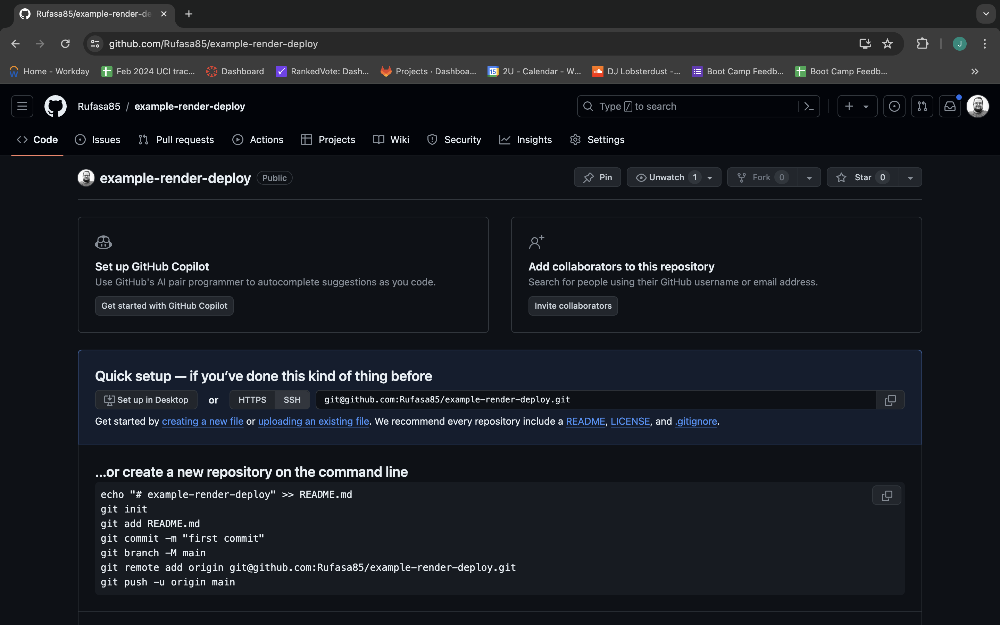
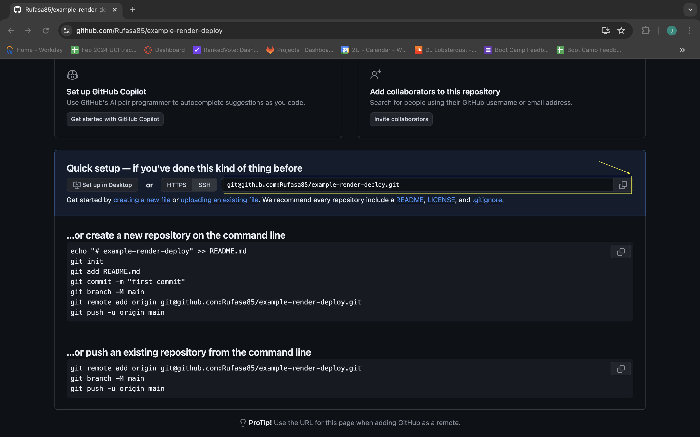

# Deploying with a front end React app with Render

* Up until now, we've been using GitHub pages to host our applications.

* In this activity, we'll take the provided `react-front-end-app` and deploy it to Render.

## Preparing the Repository

* Render allows us to deploy apps directly from a GitHub repo. Typically, we'll connect our projects to our GitHub accounts before we start working on them. Since we've provided the app here, we need to connect it to a GitHub repository.

* Create a new repository on GitHub. Make sure to leave the "Add a README" box unchecked. We want to create an entirely empty repo, like the following image:



* To prevent conflicts with the class git repo, copy the `react-front-end-app` to a different location outside of the class repo, then navigate to that file in your terminal.

* In the terminal within the `react-front-end-app` folder, run the following commands:

```sh
git init
git remote add origin <REPOSITORY_URL>
```

* We can find the correct repository URL on the default GitHub repo page, directly under the "Quick setup&mdash;if you’ve done this kind of thing before" header, as highlighted in the following image:



* Add, commit, and push your files. You should now have an independent copy of the example repo, as shown in the following image:


## Deploying to Render

### NOTE: The following guide is for a Web Service deployment aka a full stack app. If you are deploying just a front end React app (ex. Candidate Search), select "Static Site" instead of "Web Service"

Follow along with this [blog post](https://coding-boot-camp.github.io/full-stack/render/render-deployment-guide) to connect your Render account to your Github account, with the following changes:

* For the "Build Command", use the `npm run render-build` script.

  * Which should look like `"render-build": "npm install && npm run build"` in your package.json

* Publish directory should be set to `dist`

* There won't be a "Start Command" for the "Static Site"

* Don't forget to add any environment variables needed (API keys, personal access tokens, etc.)

## Review

* Nice job! You should now be able to navigate to your first deployed Render application! Render allows us to deploy front end applications for free, so this is an invaluable tool to add to your skill set!

---

© 2024 edX Boot Camps LLC. Confidential and Proprietary. All Rights Reserved.
