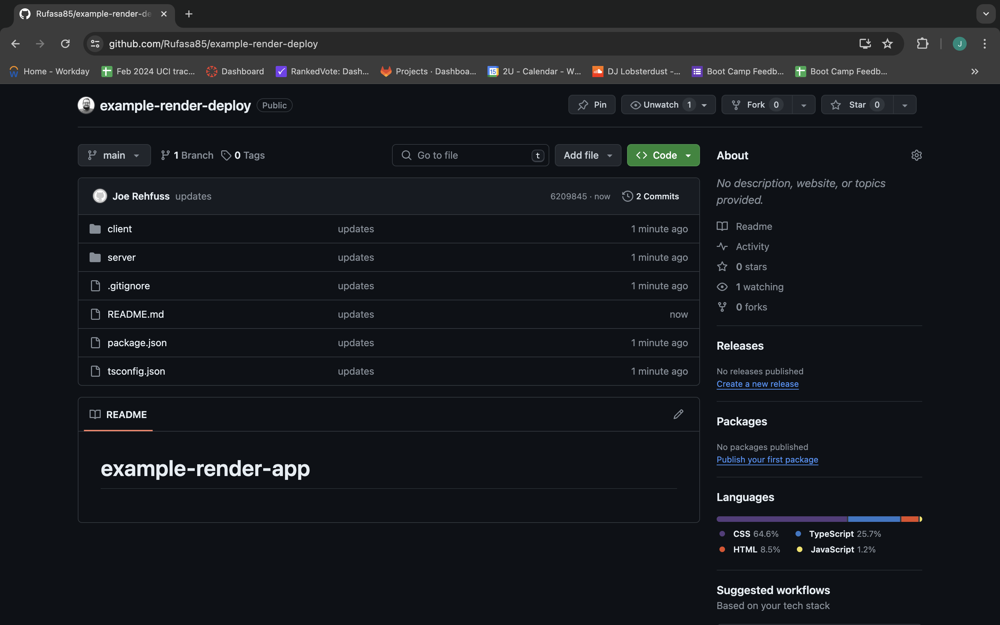

# Deploying a full stack PERN app with Render

* Up until now, we've been using GitHub pages to host our applications. However, now that we've added a server, we need a different solution, since GitHub pages only allow for static pages to be deployed. Render is a free, user-friendly deployment platform we can use.

* In this activity, we'll take the provided `PERN-fullstack-example` and deploy it to Render.

## Preparing the Repository

* Render allows us to deploy apps directly from a GitHub repo. Typically, we'll connect our projects to our GitHub accounts before we start working on them. Since we've provided the app here, we need to connect it to a GitHub repository.

* Create a new repository on GitHub. Make sure to leave the "Add a README" box unchecked. We want to create an entirely empty repo, like the following image:


* To prevent conflicts with the class git repo, copy the `PERN-fullstack-example` to a different location outside of the class repo, then navigate to that file in your terminal.

* In the terminal within the `PERN-fullstack-example` folder, run the following commands:

```sh
git init
git remote add origin <REPOSITORY_URL>
```

* We can find the correct repository URL on the default GitHub repo page, directly under the "Quick setup&mdash;if you’ve done this kind of thing before" header, as highlighted in the following image:


* Add, commit, and push your files. You should now have an independent copy of the example repo, as shown in the following image:



## Deploying to Render

### NOTE: The following guide is for a Web Service deployment aka a full stack app (ex. Module 14 Kanban Board Challenge). Render only allows one free PostgreSQL database instance. Please see [03-Render-Deploy-Supabase](../03-Render-Deploy-Supabase/README.md) for how to set up an additional database instance

Follow along with the [Deploy with Render and PostgreSQL guide](https://coding-boot-camp.github.io/full-stack/render/deploy-with-render-and-postgresql) and the [Render documentation on setting environment variables](https://docs.render.com/configure-environment-variables) to connect your Render account to your Github account, with the following changes:

* For the "Build Command", use the `npm run render-build` script.

Your root package.json should look like:

```json
"scripts": {
    "test": "echo \"Error: no test specified\" && exit 1",
    "start": "npm run client:build && npm run server",
    "start:dev": "concurrently \"npm run server:dev\" \"wait-on tcp:3001 && npm run client:dev\"",
    "server": "cd server && npm start",
    "server:dev": "cd server && npm run dev",
    "install": "cd server && npm i && cd ../client && npm i",
    "client:build": "cd client && npm run build",
    "client:dev": "cd client && npm run dev",
    "server:build": "cd server && npm run build",
    "seed": "cd server && npm run seed",
    "render-build": "npm install && npm run client:build && npm run server:build",
    "render-start": "npm run seed && npm run start"
  },
```

* The "Start Command" should be set to `npm run render-start`

  * Note: Accessing the Shell on Render to run any additional scripts is behind a paywall. That is why we need to seed the database after starting the application, since we wouldn't be able to run the scripts manually after the deployment.

* Don't forget to add any environment variables needed (JWT_SECRET_KEY, API keys, personal access tokens, DB_URL, etc.)

## Review

* Nice job! You should now be able to navigate to your first deployed Render application! Render allows us to deploy full-stack applications with a database for free, so this is an invaluable tool to add to your skill set!

---

© 2024 edX Boot Camps LLC. Confidential and Proprietary. All Rights Reserved.
