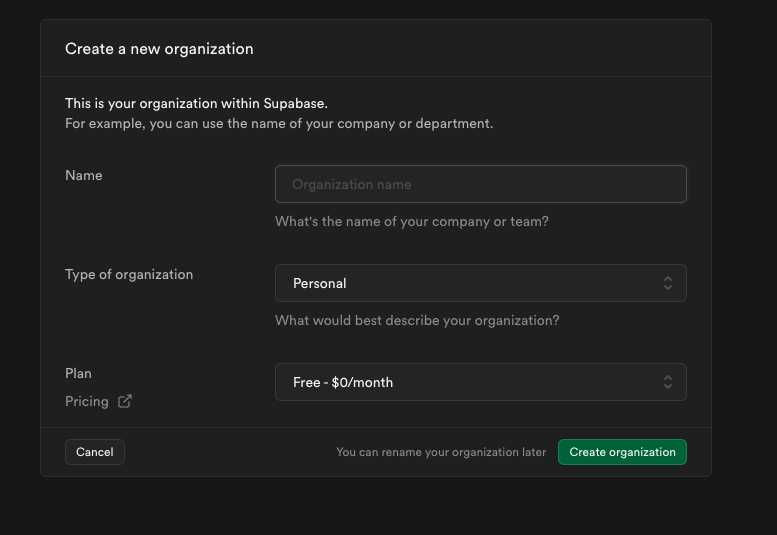
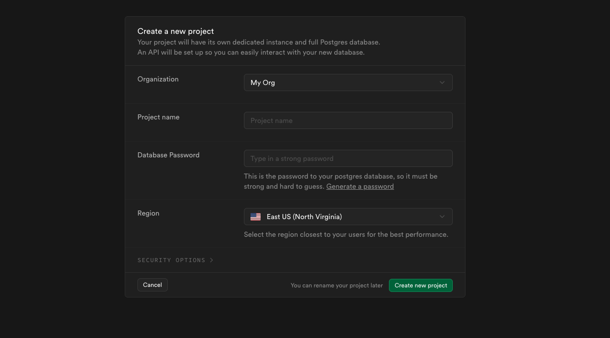
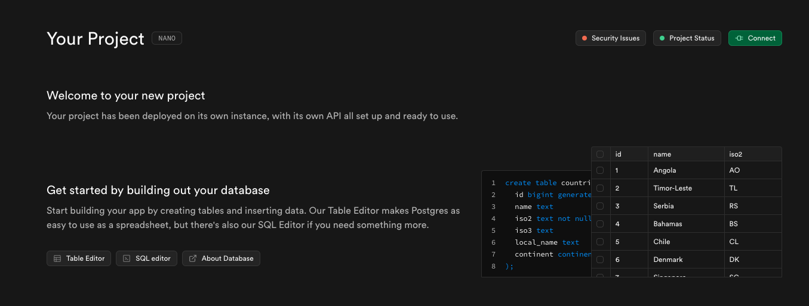
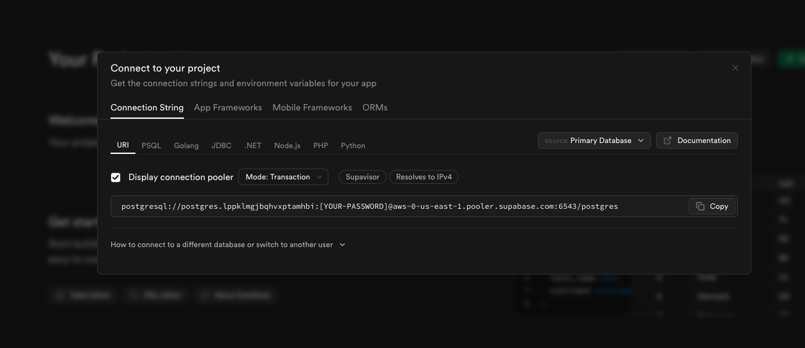

# Setting up a Supabase instance and connecting it to Render

Render only has one PostgreSQL database instance available at a time. If you wish to have multiple projects with live databases we need alternative options. Heroku and Render offer reasonable paid versions if you would like to get some more options and customer service out of your hosting and database options.

[Supabase](https://supabase.com/) is an open source alternative that also has a competitive freemium option. With the free tier we can have up to two projects running on our Supabase account.

* To get started, sign up for a Supabase account via email or by authenticating via your Github account.

* Create an Organization:


* Create a Project:
  * Remember your Database Password!


* On your project dashboard there is a green "Connect" button in the top right. There is also a link to the "Table Editor" which will be useful later.


* Copy the connection string to your clip board
  * Note: You will need to replace the square brackets `[YOUR-PASSWORD]` with the database password you set previously (don't include the square brackets)


* Continue the Render deployment as usual with the following exception. Instead of copying the "Internal Database URL" as the value to your "DB_URL" environment variable, paste the connection string with your password filled in from Supabase.

## Deploying to Render wth a Supabase DB

### NOTE: The following guide is for a Web Service deployment aka a full stack app

Follow along with the [Deploy with Render and PostgreSQL guide](https://coding-boot-camp.github.io/full-stack/render/deploy-with-render-and-postgresql) and the [Render documentation on setting environment variables](https://docs.render.com/configure-environment-variables) to connect your Render account to your Github account, with the following changes:

* For the "Build Command", use the `npm run render-build` script.

Your root package.json should look like:

```json
"scripts": {
    "test": "echo \"Error: no test specified\" && exit 1",
    "start": "npm run client:build && npm run server",
    "start:dev": "concurrently \"npm run server:dev\" \"wait-on tcp:3001 && npm run client:dev\"",
    "server": "cd server && npm start",
    "server:dev": "cd server && npm run dev",
    "install": "cd server && npm i && cd ../client && npm i",
    "client:build": "cd client && npm run build",
    "client:dev": "cd client && npm run dev",
    "server:build": "cd server && npm run build",
    "seed": "cd server && npm run seed",
    "render-build": "npm install && npm run client:build && npm run server:build",
    "render-start": "npm run seed && npm run start"
  },
```

* The "Start Command" should be set to `npm run render-start`

  * Note: Accessing the Shell on Render to run any additional scripts is behind a paywall. That is why we need to seed the database after starting the application, since we wouldn't be able to run the scripts manually after the deployment.

* Don't forget to add any environment variables needed (`JWT_SECRET_KEY`, API keys, personal access tokens, `DB_URL`, etc.)

* Instead of copying the "Internal Database URL" as the value to your `DB_URL` environment variable, paste the connection string with your password filled in from Supabase.
